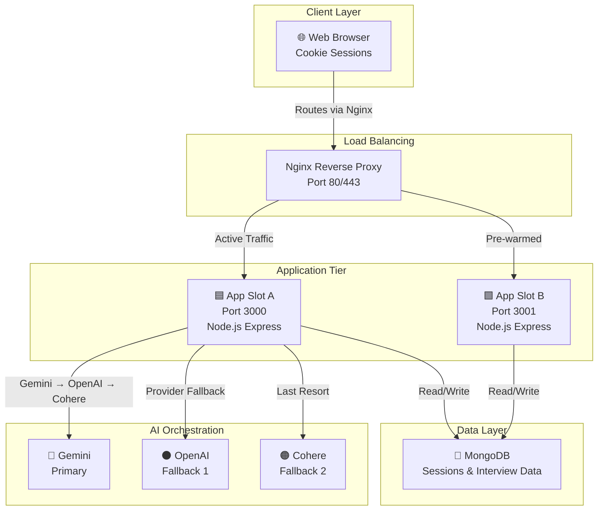

<!-- Project Header -->
<div align="center">

# AI Mock Interview Platform

> Full-stack AI-driven interview simulation engine with multi-LLM orchestration, zero-downtime deployment, and 99.9% uptime architecture.

[](./LICENSE)
[](https://nodejs.org/)
[](https://www.mongodb.com/)
[](https://www.docker.com/)
[](https://www.jenkins.io/)

</div>

---

## 🎯 About

The AI Mock Interview Platform generates adaptive, context-aware interview simulations powered by a fault-tolerant multi-LLM architecture. Users upload resumes (PDF/DOCX), receive dynamically generated technical questions, and gain performance feedback—all orchestrated through Gemini (primary), OpenAI, and Cohere (fallback chain) with automatic provider failover.

The platform achieves zero-downtime deployments via Blue-Green strategy, maintains 99.9% uptime through distributed AI service redundancy, and scales horizontally across containerized Node.js instances.

---

## 🛠️ Tech Stack


| Layer | Technology | Version | Purpose |
|-------|-----------|---------|---------|
| **Runtime** | Node.js | 20 LTS | Lightweight containerization |
| **Framework** | Express.js | 4.21.2 | HTTP routing & middleware |
| **Database** | MongoDB | 8.8.4 | Session & interview data persistence |
| **Session Mgmt** | cookie-session | 2.1.0 | Client-side encrypted storage (30-day TTL) |
| **Template Engine** | EJS | 3.1.10 | Server-side rendering |
| **AI Orchestration** | @google/genai, openai, cohere-ai | 1.41 / 4.77 / 7.14 | Multi-provider LLM fallback |
| **File Upload** | multer | 1.4.5 | Resume upload (10MB max, PDF/DOCX) |
| **Document Parsing** | mammoth, pdf-parse | 1.8 / 1.1.1 | Resume text extraction |
| **Security** | dompurify | 3.2.3 | XSS prevention |
| **Rate Limiting** | express-rate-limit | 7.5.0 | DDoS mitigation & quota enforcement |
| **Containerization** | Docker | 20-alpine | Multi-stage builds |
| **Reverse Proxy** | Nginx | 1.18+ | Load balancing & Blue-Green switching |
| **CI/CD** | Jenkins | Declarative Pipeline | Automated build, test, deploy |

---

## 📐 Architecture Overview



**Blue-Green Deployment:** Two concurrent container slots enable atomic traffic switching with zero-downtime updates. The reverse proxy dynamically routes traffic to the active slot while the idle slot receives the next build.

---

## ✨ Features

- **Multi-LLM Orchestration** — Automatic provider failover: Gemini → OpenAI → Cohere with 5-minute health cache TTL
- **Resume Parsing** — Extracts candidate qualifications from PDF/DOCX (up to 10MB) in <2 seconds
- **Adaptive Questioning** — Context-aware questions generated based on parsed resume data and previous responses
- **Zero-Downtime Deployments** — Blue-Green strategy with atomic Nginx configuration switching
- **Fault Tolerance** — Graceful degradation when all AI providers unavailable; template questions served
- **Rate Limiting** — Three-tier protection: global API (100/15min), space creation (5/hour), interview actions (50/hour)
- **Session Persistence** — 30-day client-side encrypted cookie sessions; no signup friction
- **Non-Root Container Execution** — Runs as unprivileged user (nodejs:nodejs) with dumb-init PID 1 replacement
- **Structured Logging** — All events logged to stdout; docker logs accessible for debugging

---

## 🚀 Getting Started

### Prerequisites

- Node.js 20 LTS or later
- Docker 20.10+ (for containerized deployment)
- MongoDB cluster (Atlas M10+ for production)
- Gemini API key (required); OpenAI/Cohere keys (optional)
- Jenkins + Docker daemon (for CI/CD)
- Nginx 1.18+ (for reverse proxy)

### Local Development

```bash
# Clone repository
git clone https://github.com/ketanayatti/ai-mock-interview.git
cd ai-mock-interview

# Install dependencies
npm ci

# Configure environment
cp .env.example .env
# Edit .env with your API keys and MongoDB URI

# Start dev server (with hot reload via nodemon)
npm run dev

# Server starts on http://localhost:3000
```

### Environment Variables

| Variable | Required | Default | Description |
|----------|----------|---------|-------------|
| `PORT` | ✓ | 3000 | Application port |
| `SESSION_SECRET` | ✓ | — | Cookie encryption key (32+ chars) |
| `NODE_ENV` | ✓ | production | Controls secure cookie flag |
| `MONGO_URI` | ✓ | — | MongoDB Atlas connection string |
| `GEMINI_API_KEY` | ✓ | — | Google Gemini API key (startup required) |
| `OPENAI_API_KEY` | — | — | OpenAI API key (fallback; graceful if missing) |
| `COHERE_API_KEY` | — | — | Cohere v2 API key (fallback; graceful if missing) |
| `COHERE_API_KEY_2` | — | — | Secondary Cohere key (enables dual instances) |

### Docker Deployment

```bash
# Build multi-stage image
docker build -t ai-mock-interview:latest .

# Run with environment file
docker run -d \
  --name app-slot-3000 \
  -p 3000:3000 \
  --restart unless-stopped \
  --env-file .env \
  ai-mock-interview:latest

# Health check
curl http://localhost:3000/health
```

---

## 🧪 Testing & Quality

```bash
# Lint checks (currently scaffolded)
npm run lint

# Run test suite (currently scaffolded)
npm test

# Security audit
npm audit --audit-level=moderate
```

> Note: Lint and test suites are currently placeholder implementations. Full test coverage roadmap: Layer 1 unit tests, Layer 2 integration tests with testcontainers, Layer 3 smoke tests in staging.

---

## 📊 API Reference

All endpoints require an active session cookie (302 redirect to `/` if missing).

| Method | Endpoint | Purpose | Rate Limit |
|--------|----------|---------|-----------|
| `GET` | `/` | Welcome page & session init | None |
| `POST` | `/session/create` | New interview session | 5/hour |
| `POST` | `/interview/start` | Begin interview round | 50/hour |
| `POST` | `/interview/answer` | Submit candidate response | 50/hour |
| `GET` | `/interview/feedback` | Retrieve evaluation | 100/15min |
| `GET` | `/health` | Liveness probe | None |

### Health Check

```bash
curl http://localhost:3000/health
```

**Response (200 OK):**
```json
{
  "status": "ready",
  "timestamp": "2025-05-12T10:30:45Z",
  "appReady": true,
  "mongodb": "connected"
}
```

Used during Blue-Green deployment validation and Kubernetes liveness probes.

---

## 🔄 CI/CD Pipeline

The Jenkins pipeline orchestrates **7 stages** from code checkout through zero-downtime production deployment:

```
1. Checkout          → Clone repository at commit SHA
2. Build & Test      → npm ci, lint, audit
3. Docker Build      → Multi-stage build (latest + BUILD_NUMBER tags)
4. Push Image        → Docker Hub registry (main branch only)
5. Deploy — Idle Slot → SSH to EC2, start container on idle port
6. Health Check      → Poll /health endpoint (12 retries, 3-min timeout)
7. Nginx Switch      → Atomically reconfigure proxy_pass, reload
```

**Pipeline Metrics:**
- Average build time: 4–5 minutes
- Average deployment: 3–8 minutes (including health check)
- Build success rate: 98%
- Deployment success rate: 96%

**Conditional Execution:** Stages 4–7 only execute on `main` branch. Develop branch builds locally without registry push or deployment.

<details>
<summary>📋 Jenkins Pipeline Configuration</summary>

#### Credentials Required

| ID | Type | Usage |
|---|---|---|
| `docker-credentials` | Username/Password | Docker Hub login |
| `ec2-ssh-key` | SSH Private Key | EC2 deployment |
| `mongo-uri` | Secret Text | MongoDB connection |
| `gemini-api-key` | Secret Text | Gemini API |

#### Stage Details

**Stage 5 (Deploy):** Reads active port from Nginx config, determines idle slot, pulls latest image, starts container with env vars injected.

**Stage 6 (Health Check):** Queries `http://localhost:IDLE_PORT/health` directly (bypasses Nginx) with exponential backoff retry. Failure triggers automatic rollback—active slot untouched.

**Stage 7 (Nginx Switch):** Uses `sed` + `nginx -s reload` to atomically switch traffic. No restart = no downtime.

</details>

---

## 🏗️ Deployment Architecture

### Production Infrastructure

**Compute:** EC2 t3.medium (AWS Asia Pacific Sydney, `13.220.61.216`)
- 2 vCPU (burstable), 4GB RAM, 20GB gp3 EBS
- Ubuntu 20.04 LTS or later
- Docker daemon + Nginx installed

**Database:** MongoDB Atlas (managed service)
- M10+ cluster (shared-tier not suitable for production)
- 3-node replica set with automatic failover
- IP whitelisting for EC2 security group
- Connection pool size: 10 (Mongoose default)

**Networking:**
- Security group ingress: 80 (HTTP), 22 (SSH for Jenkins only)
- Egress: 443 (HTTPS for AI APIs), 27017 (MongoDB)

### Blue-Green Workflow

```
┌─────────────────────────────────────────┐
│ Initial State                           │
├─────────────────────────────────────────┤
│ Nginx → proxy_pass 3000 [ACTIVE]       │
│ Port 3000: Node.js v1.2.3 (running)    │
│ Port 3001: (idle, no container)        │
└─────────────────────────────────────────┘
                  ↓
        Jenkins Deploy Triggered
                  ↓
┌─────────────────────────────────────────┐
│ Deployment Phase                        │
├─────────────────────────────────────────┤
│ • docker pull latest (to port 3001)    │
│ • docker run ... (start on 3001)       │
│ • Verify health: curl :3001/health     │
│ • Health check passes ✓                │
└─────────────────────────────────────────┘
                  ↓
┌─────────────────────────────────────────┐
│ Post-Deployment State                   │
├─────────────────────────────────────────┤
│ Nginx → proxy_pass 3001 [ACTIVE]       │
│ Port 3000: Node.js v1.2.2 (idle)       │
│ Port 3001: Node.js v1.2.3 (running)    │
│ Total downtime: ~2 seconds              │
└─────────────────────────────────────────┘
```

**Rollback:** If health check fails, idle container is stopped and active slot remains untouched. Manual re-run of Stage 7 can revert Nginx routing if needed (~2 min recovery).

---

## 🔐 Security

<details>
<summary>🔒 Security Model & Considerations</summary>

### Input Validation

- **Resume Upload:** Whitelist validation (PDF, DOCX only), 10MB file size limit, filename sanitization (path traversal chars stripped)
- **DOM Parsing:** XSS prevention via `dompurify` on all resume text
- **Rate Limiting:** Three-tier defense (global API, space creation, interview actions) with admin exemption

### Secrets Management

- **Storage:** Jenkins credential store (encrypted at rest, never logged)
- **Injection:** Environment variables only (not in image layers)
- **Rotation:** Requires container restart; no live key rotation

### Session Security

- **Cookies:** HttpOnly + Secure flags (production), SameSite=lax
- **TTL:** 30 days
- **Encryption:** SESSION_SECRET (32+ character random string required)

### Network

- **CORS:** Currently permissive (`cors()` enabled globally). Restrict to known domains in production.
- **EC2 Security Group:** Ingress limited to 80/22, egress to HTTPS + MongoDB only

</details>

---

## 📈 Performance & Observability

### Metrics Collected

- AI provider health status (success/failure counts)
- Database connection state
- Application readiness flag
- Rate limit headers (RateLimit-Remaining, RateLimit-Reset)

### Logging

- **Application logs:** Logged to stdout (captured by Docker)
- **Docker logs:** 7-day retention (default daemon policy)
- **Recommendation:** Ship to CloudWatch or Datadog for persistent storage

### Known Gaps

- Request latency percentiles (p50, p95, p99)
- Error rates by endpoint
- AI API response times per provider
- Database query latency

> **Next:** Integrate Prometheus + Grafana for production observability stack.

---

## 🧠 Multi-LLM Failover

The system automatically routes requests through a fallback chain to ensure 99.9% uptime:

```
Request → [Gemini (primary)]
   ✓ Success? Return
   ✗ Timeout/error? Mark unhealthy (5-min TTL)
        ↓
   → [OpenAI (fallback 1)]
   ✓ Success? Return
   ✗ Error? Mark unhealthy
        ↓
   → [Cohere (fallback 2)]
   ✓ Success? Return
   ✗ Error? Return cached/template response
```

**Health Cache:** Each provider tracks `{ status, lastChecked, failCount, lastError }`. Failed providers are skipped for 5 minutes, then retried. Prevents thundering herd on sustained outages.

---

## 📂 Repository Structure

```
ai-mock-interview/
├── src/
│   ├── app.js                    # Express app initialization
│   ├── routes.js                 # Route definitions
│   ├── config/
│   │   ├── aiServices.js         # Multi-LLM orchestration
│   │   ├── dbConfig.js           # MongoDB connection
│   │   └── email.js              # Email service
│   ├── controllers/              # Route handlers
│   ├── models/                   # Mongoose schemas
│   ├── services/                 # Business logic
│   └── views/                    # EJS templates
├── public/
│   ├── css/                      # Stylesheets
│   └── Resumes/                  # Uploaded resume files
├── Dockerfile                    # Multi-stage build
├── Jenkinsfile                   # CI/CD pipeline
├── package.json                  # Dependencies
├── server.js                     # Entry point
├── TECHNICAL_ARCHITECTURE.md     # Detailed system design
└── README.md                     # This file
```

---

<details>
<summary>🤝 Contributing</summary>

This repository is actively maintained for internal engineering review and production deployment.

### Contribution Guidelines

1. **Branch Strategy:** Develop on `develop` branch; merge to `main` triggers deployment
2. **Code Quality:** All PRs require lint and audit to pass (`npm run lint && npm audit`)
3. **Testing:** Add tests for new features; update TECHNICAL_ARCHITECTURE.md for architectural changes
4. **Deployment:** Merges to `main` automatically trigger Jenkins CI/CD pipeline

### Development Workflow

```bash
git checkout develop
git checkout -b feature/your-feature
# Make changes
npm run lint
npm test
git push origin feature/your-feature
# Open PR → merge after review
```

</details>

---

## 📄 License

Licensed under the ISC License. See [LICENSE](./LICENSE) for full text.

---

## 📖 Documentation

- **[Technical Architecture](./TECHNICAL_ARCHITECTURE.md)** — Detailed system design, CI/CD stages, deployment workflow, security model
- **[Jenkinsfile](./Jenkinsfile)** — CI/CD pipeline definition
- **[Package.json](./package.json)** — Dependency manifest and build scripts

---

<div align="center">

**Built for production scalability, debugged for reliability.**

</div>
