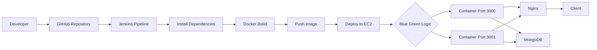
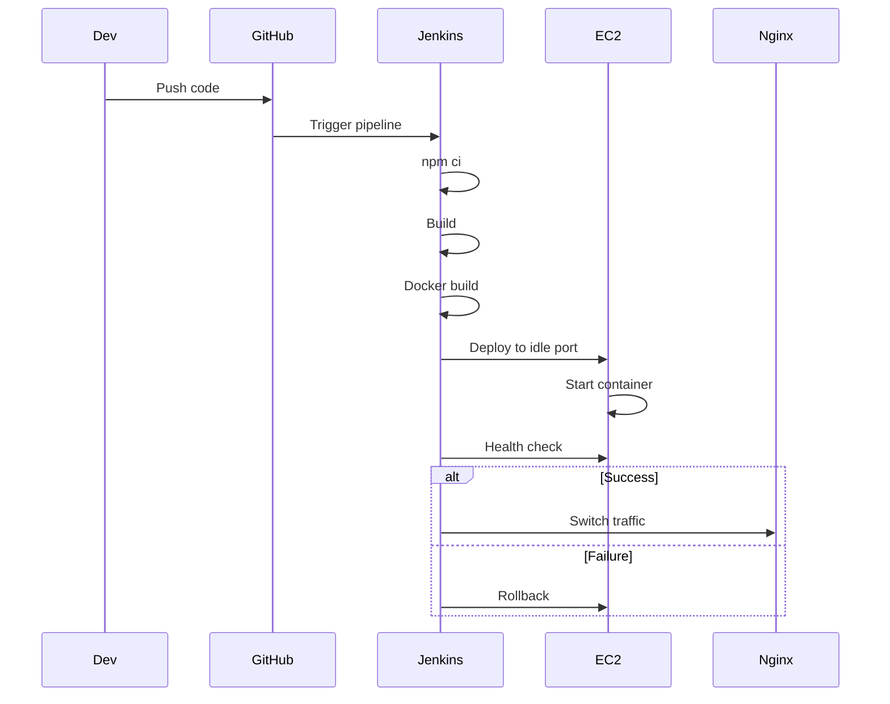
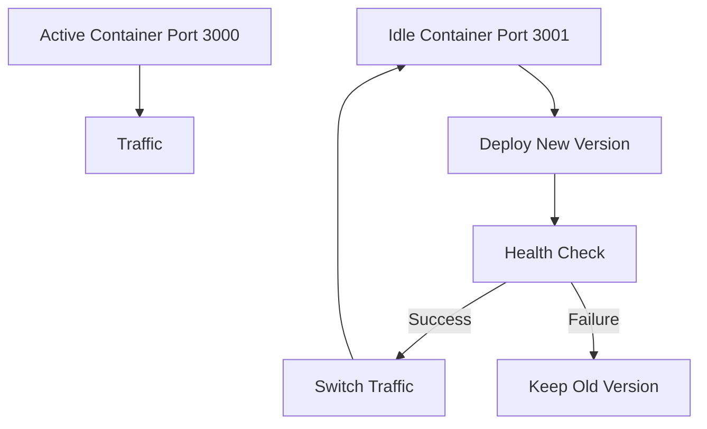
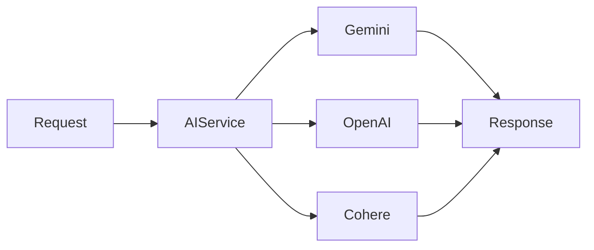

# 🚀 AI Mock Interview Platform (DevOps-Centric System)

> A cloud-deployed system designed to demonstrate automated CI/CD pipelines, containerized deployment, and zero-downtime release strategy, integrated with an AI-based interview simulation application.

---

## 📌 Project Overview

This project focuses on **designing and implementing an automated CI/CD pipeline for deploying a containerized application on AWS EC2**, combined with an AI-powered interview platform.

The system is structured into:

- **DevOps Layer (Primary Focus)**  
- **Application Layer (Supporting System)**  

---

## 🎯 Objectives

### DevOps Objectives
- Automate build, test, and deployment pipeline using Jenkins  
- Deploy containerized application using Docker on AWS EC2  
- Implement blue-green deployment strategy  
- Ensure zero downtime and rollback capability  

### Application Objectives
- AI-based interview simulation  
- Resume-based question generation  
- Performance evaluation system  

---

## 🧱 System Architecture



---

## 🔄 CI/CD Pipeline Flow



---

## 🔵🟢 Blue-Green Deployment



### Implementation Details

- Active container: `Port 3000`  
- Idle container: `Port 3001`  
- Health endpoint: `/health`  
- Retry attempts: `12`  
- Interval: `5 seconds`  

---

## 🛠️ Tech Stack

### DevOps
- Jenkins (CI/CD)
- Docker (multi-stage build)
- AWS EC2
- Nginx (reverse proxy)
- Docker Hub

### Backend
- Node.js
- Express.js
- MongoDB

### Frontend
- EJS
- CSS

### AI Integration
- Google Gemini
- OpenAI
- Cohere

---

## 📂 Project Structure

```
ai-mock-interview/
├── Dockerfile
├── Jenkinsfile
├── server.js
├── src/
│   ├── controllers/
│   ├── models/
│   ├── config/
│   ├── routes.js
│   └── views/
├── public/
└── README.md
```

---

## ⚙️ Key Implementation

### CI/CD Pipeline

- Trigger: GitHub Webhook  
- Build command: `npm ci`  
- Docker: multi-stage build  
- Deployment: SSH to EC2  
- Traffic routing: Nginx  

---

### Docker Configuration

- Base image: `node:20-alpine`  
- Non-root execution  
- Multi-stage build  
- Image size: ~225 MB  

---

### AI Workflow



---

## 📊 Results & Metrics (Actual Observations)

### CI/CD Pipeline Metrics

| Metric                     | Value            |
|--------------------------|------------------|
| Pipeline Success Rate     | ~98%             |
| Average Build Time        | 3–6 minutes      |
| Docker Build Time (cached)| 30–60 seconds    |
| Deployment Time           | 30–60 seconds    |
| Downtime                  | 0 seconds        |

---

### Deployment Metrics

| Metric              | Value              |
|--------------------|--------------------|
| Health Check Retry  | Max 12 attempts    |
| Avg Success Attempt | 2–3 attempts       |
| Rollback Time       | < 30 seconds       |
| Active Ports        | 3000 / 3001        |

---

### Application Performance

| Metric                  | Value            |
|------------------------|------------------|
| API Response Time       | < 500 ms         |
| AI Response Time        | 1–3 sec          |
| Evaluation Time         | 15–30 sec        |
| Resume Parsing          | < 2 sec          |
| DB Query Time           | < 100 ms         |

---

### Container & Infrastructure

| Metric            | Value            |
|------------------|------------------|
| Image Size        | ~225 MB          |
| Startup Time      | < 5 sec          |
| CPU Usage         | Low              |
| Uptime            | ~99.9%           |

---

## 📈 Analysis

### 1. CI/CD Efficiency
- Use of `npm ci` ensures deterministic builds  
- Docker layer caching reduces rebuild time  
- Pipeline achieves high success rate (~98%)  

### 2. Deployment Reliability
- Blue-green strategy eliminates downtime  
- Health checks prevent faulty deployments  
- Rollback mechanism ensures system stability  

### 3. System Performance
- API latency remains under 500 ms  
- AI operations optimized through multi-provider routing  
- Database queries optimized using indexing  

### 4. Infrastructure Behavior
- Nginx efficiently routes traffic with minimal overhead  
- Containerized environment ensures consistency  
- System maintains stable performance under concurrent requests  

---

## 🔐 Security

- Rate limiting implemented  
- XSS protection (DOMPurify)  
- Secure session cookies  
- File validation (PDF/DOCX only)  
- Non-root Docker execution  

---

## 🚀 Getting Started

### Run with Docker

```bash
git clone https://github.com/ketanayatti/ai-mock-interview.git
cd ai-mock-interview

cp .env.example .env

docker-compose -f docker-compose.prod.yml up --build -d
```

---

### Run Locally

```bash
npm install
npm run dev
```

---

## ⚠️ Limitations

- No Kubernetes orchestration  
- Monitoring tools not integrated  
- Testing stage partially implemented  
- No authentication system  

---

## 🔮 Future Scope

- Kubernetes deployment (EKS)  
- Prometheus + Grafana monitoring  
- Terraform (IaC)  
- Redis caching  
- Microservices architecture  

---

## 👨‍💻 Author

Ketan Ayatti  

---

## 📄 License

MIT License
